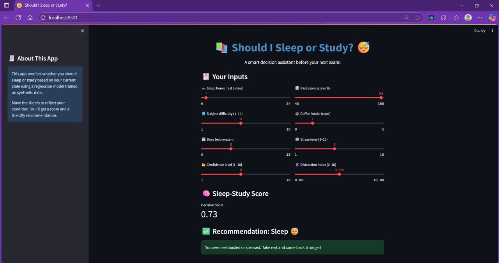
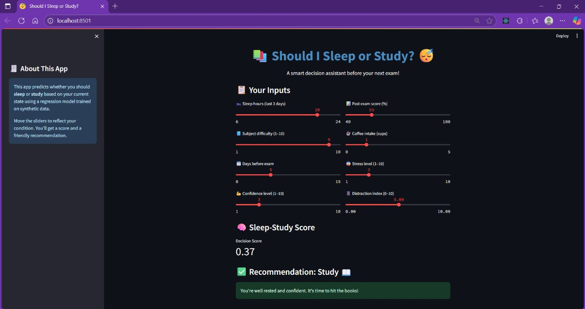

# 💤 Should I Sleep or Study? 🤖

A regression-based machine learning app that helps students make better decisions before exams.  
Given inputs like sleep hours, subject difficulty, confidence, and stress levels, this model predicts whether you should **sleep** or **study** — and how strongly.

  

---

## 🚀 Features

- 🔁 Predicts a score from **0 to 1**:  
  `0` = Study 📖 | `1` = Sleep 😴
- 📊 Powered by a **linear regression model**
- 🧠 Uses 8 real-life features like:
  - Sleep hours
  - Stress & confidence levels
  - Distractions (e.g., phone time)
  - Exam proximity
- 🎨 Built with **Streamlit** for an interactive web UI

---

## 🧪 How It Works

The app predicts a **"sleep-study score"** using the following inputs:

| Feature | Description |
|--------|-------------|
| `sleep_hours_last_3_days` | Total sleep in past 3 days |
| `subject_difficulty` | How hard the subject feels (scale 1–10) |
| `exam_proximity_days` | Days left before the exam |
| `confidence_level` | Your confidence in the subject (1–10) |
| `past_exam_score` | Your previous exam score in the subject |
| `coffee_intake` | Cups of coffee consumed today |
| `stress_level` | Current stress level (1–10) |
| `distraction_index` | Time spent being distracted (scaled 0–10) |

---
 

---

## 📁 Project Structure

sleep-or-study/
├── sleep_study_model.pkl # Trained regression model
├── app.py # Streamlit web app
├── sleep_or_study_regression.ipynb # Colab notebook with training steps
└── README.md


---

## ⚙️ Setup Instructions

### 1. Clone the Repository
```bash
git clone https://github.com/yourusername/sleep-or-study.git
cd sleep-or-study

2. Install Dependencies

pip install -r requirements.txt

pip install streamlit scikit-learn pandas numpy joblib matplotlib seaborn

3. Run the App

streamlit run app.py
🤖 Model Training

You can view and modify the training process using the included notebook:

sleep_or_study_regression.ipynb

💡 Inspiration
This project was built as a fun but practical machine learning app to help students like myself make smarter decisions during high-pressure study days. Sleep is important — but so are exams!


✨ Author
Shriyanshi Gaur

Passionate about AI, ML, and making fun decision support tools!
